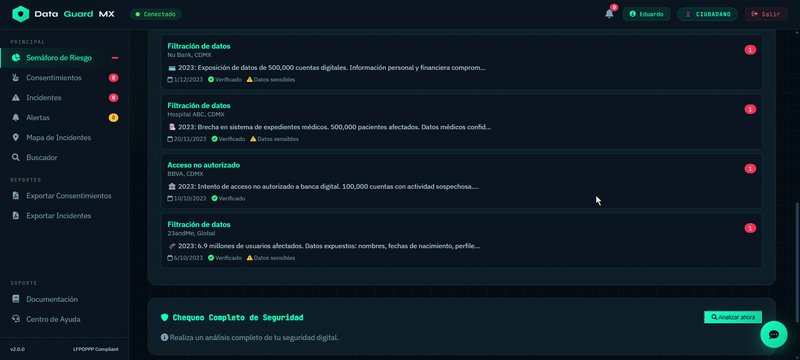
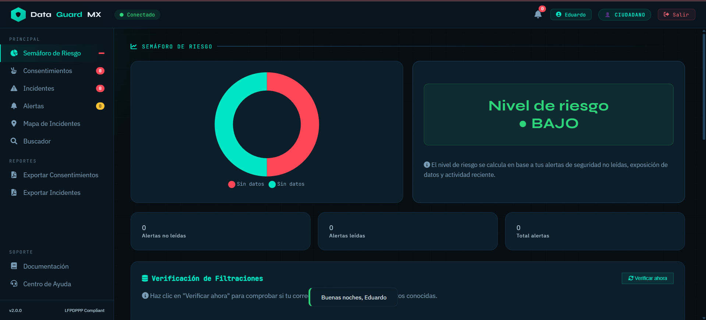
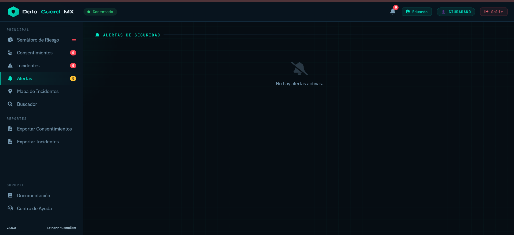
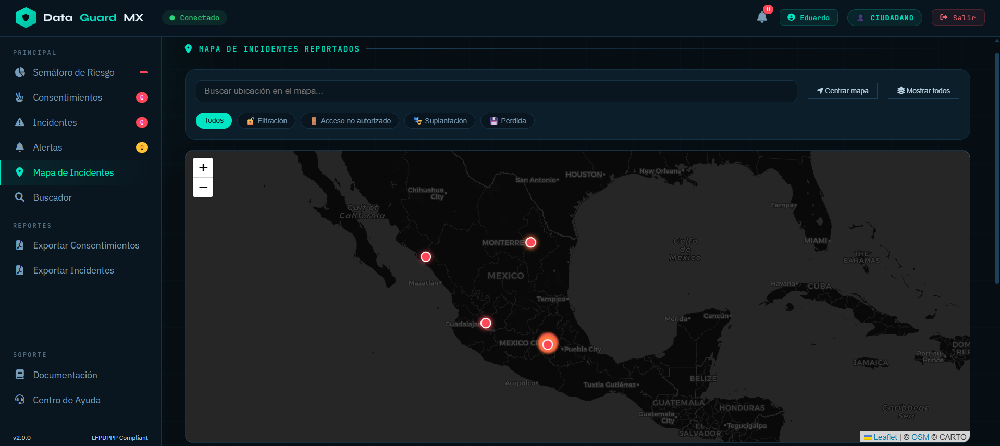
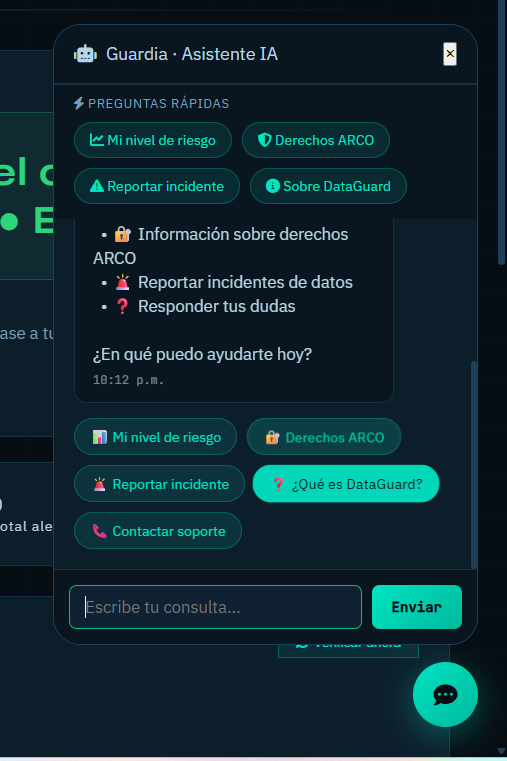

# 🛡️ DataGuardMX

<p align="center">
  
  
  
  
  
  
</p>

<p align="center">
  <b>Plataforma SaaS de protección de identidad digital en México 🇲🇽</b><br>
  <i>"Tu identidad digital, bajo tu control"</i>
</p>

---

## 🎬 Demo (Animación)

<p align="center">
  
</p>

> 💡 Tip: puedes grabar este GIF con ScreenToGif o OBS

---

## 📸 Screenshots

### 🧭 Dashboard Principal

<p align="center">
  
</p>

### 🚨 Alertas de Seguridad

<p align="center">
  
</p>

### 🗺️ Mapa de Incidentes

<p align="center">
  
</p>

### 🤖 Chatbot "Guardia"

<p align="center">
  
</p>

---

## 🚀 Descripción

**DataGuardMX** es una plataforma que protege la identidad digital de ciudadanos y empresas frente a riesgos derivados de la centralización de datos como:

* CURP
* Número telefónico
* Datos personales sensibles

Integra automatización, visualización de datos y seguridad en un solo sistema.

---

## ⚠️ Problema

México enfrenta un riesgo creciente de:

* Robo de identidad
* Filtraciones masivas
* Fraudes financieros

Debido a la centralización de datos en sistemas gubernamentales.

---

## 💡 Solución

DataGuardMX proporciona:

* 🚨 Alertas de filtraciones
* 📊 Semáforo de riesgo
* 📑 Gestión de consentimientos
* ⚖️ Cumplimiento ARCO
* 🤖 Chatbot inteligente

---

## 🧱 Arquitectura

```
Frontend → Backend → Supabase → n8n
```

---

## ⚙️ Instalación

```bash
git clone https://github.com/tu-usuario/dataguardmx.git
cd dataguardmx

cp .env.example .env

npm install
npm run dev
```

---

## 🌐 Acceso

| Servicio | URL                       |
| -------- | ------------------------- |
| App      | http://localhost:3000     |
| API      | http://localhost:3000/api |
| n8n      | http://localhost:5678     |

---

## 📌 Funcionalidades

* Dashboard interactivo
* Sistema de autenticación (JWT)
* Gestión de usuarios
* Reporte de incidentes
* Chatbot automatizado
* Exportación de PDF
* Verificación de filtraciones

---

## 🧠 Stack Tecnológico

**Backend**

* Node.js
* Express
* Supabase

**Frontend**

* HTML, CSS, JS
* Leaflet
* Chart.js

**Infraestructura**

* Docker
* Nginx
* n8n

---

## 🔐 Seguridad

* JWT Authentication
* bcrypt hashing
* Helmet (headers)
* Rate limiting
* RBAC (roles)

---

## 📊 Estado del Proyecto

| Fase          | Estado |
| ------------- | ------ |
| MVP           | ✅      |
| Escalabilidad | 🚧     |
| Expansión     | 🔮     |

---

## 🧪 Scripts

```bash
npm run dev
npm start
npm run test
```

---

## 🧠 Roadmap

* IA avanzada (GPT / Gemini)
* Monitoreo real de filtraciones
* App móvil
* 2FA

---

## 🤝 Contribuir

```bash
git checkout -b feature/nueva
git commit -m "feat: nueva funcionalidad"
git push origin feature/nueva
```

---

## 📜 Licencia

MIT

---

## ✨ Autor
**Miriam Edith Garcia Miguel**
**Sabina Perez Olvera**
**Eduardo Ochoa Almaraz**

---

## ⭐ Dale estrella

Si te gustó el proyecto, dale ⭐ en GitHub 🙌
